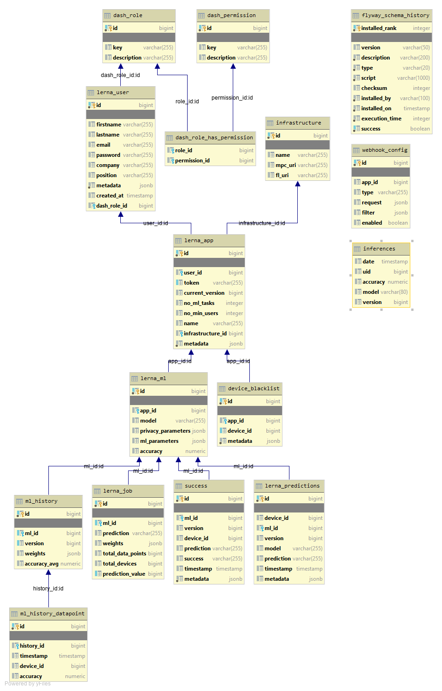

  

# Postgres Database
Lerna AI uses Postgres[[1]](#references) database to persist users, FL parameters per application, ML models parameters and weights.

The FL-API uses flyway[[2]](#references) in order to produce the database schema and automate the database deployment on PostgreSQL, at the first run.

The following ER diagram depicts the database schema.

## Requires

* PostgreSQL Server

## Required by

* Lerna FL-API

* Lerna Config Server

## References

[1] [PostgreSQL](https://www.postgresql.org/)

[2] [MPC Readme File](https://www.red-gate.com/products/flyway/community/)
