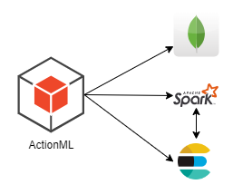

<p align="center">
  
</p>

# Lerna AI Recommendation Service
Lerna Recommendation Service is an optional service on Lerna stack that is based on [ActionML](https://github.com/actionml) and [Universal Recommender](https://github.com/actionml/universal-recommender).
It uses MongoDB to persist model configurations and data, Apache Spark to run training tasks, and ElasticSearch to persist and retrieve the trained models.



## Execution

Lerna Recommendation service infrastructure is based on [Harness Docker Compose repo](https://github.com/actionml/harness-docker-compose) and it uses dedicated EC2 instances for Spark, ElasticSearch, and Mongo.

## Configuration

### Spark

In order to install Spark, use the following steps (AWS, EC2, Ubuntu image):

> 📝 we recommend using an r4.4xlarge EC2 instance with 100GB disk to host Spark.

Install JDK 11

```shell
sudo apt install openjdk-11-jre-headless
```

Download Spark 2.3.3 with Hadoop 2.7
```shell
wget https://archive.apache.org/dist/spark/spark-2.3.3/spark-2.3.3-bin-hadoop2.7.tgz
```
Extract files
```shell
tar -zxvf spark-2.3.3-bin-hadoop2.7.tgz
```
Add spark directory to path
```shell
export SPARK_HOME=/home/ubuntu/spark-2.3.3-bin-hadoop2.7
export PATH=$SPARK_HOME/bin:$PATH
```

Create Spark environment configuration from template
```shell
cd spark-2.3.3-bin-hadoop2.7/conf
cp spark-env.sh.template spark-env.sh 
```

Edit `spark-env.sh` by adding the following lines in the respective section
```shell
SPARK_MASTER_HOST=0.0.0.0
SPARK_MASTER_PORT=7077
SPARK_WORKER_INSTANCES=15
SPARK_WORKER_CORES=1
```

Start Spark master node

```shell
sbin/start-master.sh
```

Start Spark slave nodes

```shell
sbin/start-slave.sh spark://localhost:7077
```

### MongoDB

MongoDB should run as a docker container. You can start it with the following docker-compose script:

```yaml
version: '3'
services:

  mongo:
    restart: always
    image: mongo:4.2
    container_name: mongo
    command: --logappend --logpath=/tmp/mongod.log
    ports:
      - "27017:27017"
    volumes:
      - ${MONGO_LOGS}:/logs
      - ${MONGO_DATA}:/data/db
```

We also need to set up the required environment variables. You can use the following `.env` file:

```shell
MONGO_LOGS=./docker-persistence/mongo/logs
MONGO_DATA=./docker-persistence/mongo/data/db
```

### ElasticSearch

ElasticSearch should run as a docker container. You can start it with the following docker-compose script:

```yaml
version: '3'
services:

  elasticsearch:
    restart: always
    image: elasticsearch:7.6.0
    container_name: elasticsearch
    environment:
      ES_JAVA_OPTS: ${ES_JAVA_OPTS}
      discovery.seed_hosts: elasticsearch
      discovery.type: single-node
    ports:
      - "9200:9200"
    volumes:
      - ${ES_DATA}:/var/lib/elasticsearch/data
```

You also need to set up the required environment variables. You can use the following `.env` file:

```shell
ES_JAVA_OPTS=-Xms512m -Xmx512m
ES_DATA=./docker-persistence/es/data
```

### ActionML

ActionML server contains three components: a main harness app, a tool that provides CLI support to the harness app, and an optional instance of watchtower that provides "hot swap" support for developers. 

ActionML should run as a docker container. You can start it with the following docker-compose script:

```yaml
version: '3'
services:

  harness:
    restart: always
    image: path/to/lerna-harness:latest
    container_name: harness
    network_mode: "host"
    environment:
      MONGO_URI: mongodb://<MongoDB IP Address>:27017
      HARNESS_URI: http://0.0.0.0:9090
      ELASTICSEARCH_URI: http://<ElasticSearch IP Address>:9200
      JOBS_EXPIRE_AFTER: ${JOBS_EXPIRE_AFTER:-96 hours}
      HARNESS_OPTS: ${HARNESS_OPTS:- -J-Xmx12G -J-XX:+UseConcMarkSweepGC }
    volumes:
      - ${HARNESS_LOGS}:/harness/logs
      - ${HARNESS_DATA}:/data
    logging:
      driver: "json-file"
      options:
        max-size: "50m"
    deploy:
      resources:
        limits:
          memory: 64G

  harness-cli:
    restart: always
    image: actionml/harness-cli:develop
    container_name: harness-cli
    network_mode: "host"
    environment:
      HARNESS_SERVER_ADDRESS: localhost
    volumes:
      - ${HARNESS_DATA}:/data

  watchtower:
    restart: always
    image: v2tec/watchtower
    container_name: watchtower
    network_mode: "host"
    volumes:
      - /var/run/docker.sock:/var/run/docker.sock
    command: --interval 3000
```

You also need to set up the required environment variables. You can use the following `.env` file:

```shell
HARNESS_LOGS=./docker-persistence/harness/logs
HARNESS_DATA=./docker-persistence/harness/data
```

## Requires

- MongoDB
- Apache Spark
- ElasticSearch

## Required by

- FL-API (optional)

## References

[FL-API Repository](https://github.com/lerna-ai/lerna-fl-server)

[FL-API Readme File](https://github.com/lerna-ai/lerna-fl-server/blob/master/README.md)
