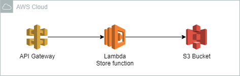

<p align="center">
  
</p>

# AWS Cloud for storage
Lerna AI's stack optionally uses AWS Cloud services to persist application logs, errors, and training data for debug purposes, as shown on the diagram bellow.



Specifically, it uses:

* S3 Bucket to persist data

* Lambda function to authenticate users and prepare data for persistence

* API Gateway to expose REST API

## Configuration

### S3 Bucket

Bucket Policy
```json
{
    "Version": "2012-10-17",
    "Id": "Policy1234",
    "Statement": [
        {
            "Sid": "Stmt1234",
            "Effect": "Allow",
            "Principal": {
                "AWS": "arn:aws:iam::<account_number>:role/service-role/save-to-bucket-role-12345"
            },
            "Action": [
                "s3:GetObject",
                "s3:PutObject"
            ],
            "Resource": "arn:aws:s3:::<bucket_name>/public"
        }
    ]
}
```

Cross-origin resource sharing (CORS)
```json
[
    {
        "ID": "S3CORSRuleId1234",
        "AllowedHeaders": [
            "*"
        ],
        "AllowedMethods": [
            "GET",
            "HEAD",
            "PUT",
            "POST",
            "DELETE"
        ],
        "AllowedOrigins": [
            "*"
        ],
        "ExposeHeaders": [
            "x-amz-server-side-encryption",
            "x-amz-request-id",
            "x-amz-id-2",
            "ETag"
        ],
        "MaxAgeSeconds": 3000
    }
]
```

### Lambda Function

Configuration:
- Runtime: Node.js 14.x
- Handler: index.handler
- Architecture: x86_64
- Memory: 128MB
- Ephemeral storage: 512MB
- Timeout: 0min30sec

Source code:

```javascript
var AWS = require('aws-sdk');
var s3 = new AWS.S3();

const tokens = {
    "11111111-1111-1111-1111-111111111111": "NewsApp",
    "22222222-2222-2222-2222-222222222222": "ShopApp",
    "33333333-3333-3333-3333-333333333333": "BrowserApp",
    "44444444-4444-4444-4444-444444444444": "FitnessApp",
    "55555555-5555-5555-5555-555555555555": "ReaderApp"
    };

const putObjectToS3 = (key, data) => {
    console.log("putObjectToS3 to path " + key);
    var params = {
        Bucket : "<bucket_name>",
        Key :  key,
        Body : data
    };
    s3.putObject(params, function(err, data) {
      if (err) console.log(err, err.stack);
      else     console.log(data);
    });
};

const isValid = (event) => {
    return event.token && event.key && event.data;
}

exports.handler = (event, context, callback) => {
    if (!isValid(event)) {
        return callback(null, 400)
    }
    if (!tokens[event.token]) {
        return callback(null, 401)
    }
    putObjectToS3("public/path/to/" + tokens[event.token] + "/" + event.key, event.data);
    return callback(null, 200);
};
```

Test Case 1: Valid payload
```json
{
  "token": "11111111-1111-1111-1111-111111111111",
  "key": "testFile1",
  "data": "hello world!"
}
```

### API Gateway

Set up a resource with a POST method that have the following configuration:
- Resource: /logfile
- Method: POST
- Integration type: Lambda
- Lambda proxy integration: False
- Lambda function: save-to-bucket
- Input passthrough: When no template matches the request content-type header
- Timeout: Default (29 seconds)
- Content handling: Passthrough
- Method response status code: 200
- Default mapping: True

We also need to enable CORS.

## Requires

* S3 Bucket

## Required by

* Lerna Multiplatform Library
