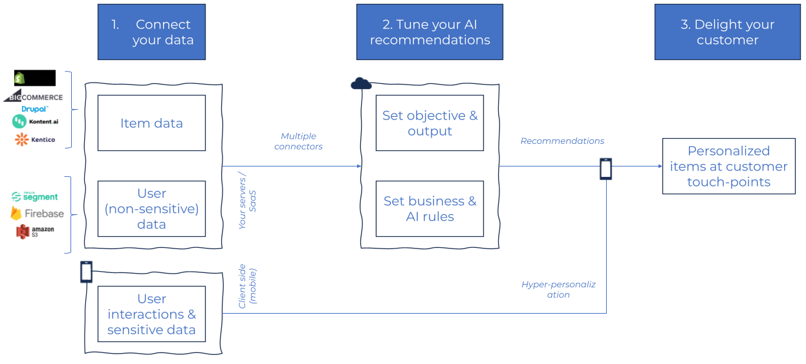
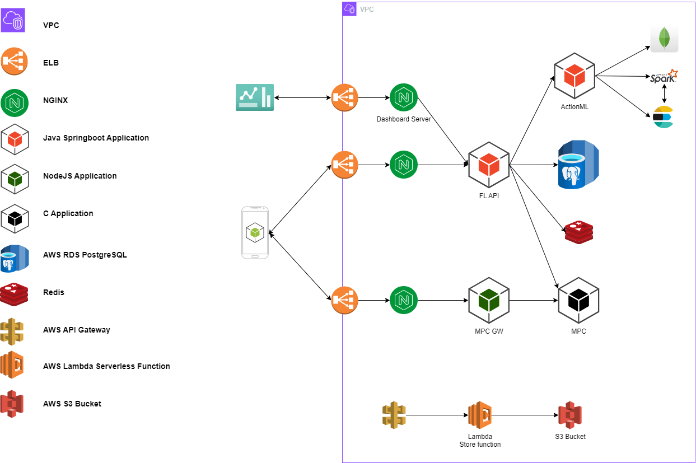

  

# Lerna AI Architecture

## What is Lerna AI?
Lerna AI helps mobile apps boost their campaign and product recommendation conversions, with the world’s first mobile hyper-personalization recommender. In a post-cookies world where third-party data are dying, apps need to better understand their users and make the most of their first-party data potential. Lerna AI mobile SDK enables apps to personalize their content to each user, by training models on content metadata along with user data, on-device. This way it predicts the optimal content for each user at a specific time while preserving user privacy.

## Understanding Lerna AI: The Basics
Lerna AI is a mobile personalization service that uses a complex 
system of servers, ML algorithms, and data analytics to deliver 
personalized content to mobile apps. The platform is known for 
the following.

### Lerna SDK
Lerna SDK is the core of machine learning module of Lerna AI. 
These web/mobile native libraries provides both functionalities 
of training and inferencing.

### Federated Learning Server
Lerna.AI uses a Federated Learning server to aggregate the ML data 
and delivered back to Lerna SDK.

### MPC Service
Lerna AI uses MPC service to ensure personal data privacy. This 
service provide mechanism to secure end-to-end communication 
between all services. Also provide mechanism to support 
communication with noised payload, that’s make pointless any 
man-in-the-middle attack.

### Recommendation Service
Lerna AI also provide an out-of-the-box recommendation service 
that developers can use in combination with Lerna AI personalization 
service.

## How does Lerna AI work? Lerna AI tech stack
The Lerna AI uses a wide range of technologies to power its federated 
learning platform. The Lerna AI hyper-personalized recommendation 
architecture is presented in the following diagram.

Here’s an overview of the technologies used in different parts of the 
Lerna AI tech stack.

### Lerna AI SDK
Lerna AI provides a multiplatform SDK that is the core of Lerna AI system. 
This SDK provides a friendly API to developer to use our federated 
learning service. The SDK implements all required functionality to collect 
data and train ML models. Also, the SDK can use ML models to predict 
personalized items for specific user.

Lerna AI SDK implemented in Kotlin Multiplatform, that can be   
native SDK for both Android and iOS platforms. Also, a beta version of 
web assembly (WASM) SDK provided for web applications.

### Lerna AI Federated Learning Service
Lerna FL Service is a centralized orchestrator/aggregator for all 
participators in a Lerna AI Machine Learning instance. In order to expose 
value of each training held on edge devices, Lerna AI requires an 
orchestrator to provide required data to edge devices and an aggregator 
to combine data and prepare it for the next iteration of machine learning.

Lerna AI Federation Learning Service is a Spring Boot application runs on 
one/multiple AWS EC2 instances. Lerna AI FL Service, also use AWS RDS Postgres 
database for persistence and a Redis instance for caching.

### Lerna AI MPC Service
Lerna AI MPC Service is a privacy service, implemented in ANSI C, that can 
be run on an Intel® Software Guard Extensions (Intel® SGX).

### Recommendation System
Lerna AI uses a custom release of ActionML OSS in order to enhance platform 
by adding an optional recommendation system.

### Front-end technologies
#### JavaScript
Lerna AI’s dashboard front end, part of the application developers interact 
with, is built primarily using JavaScript. This allows Lerna AI to create a 
highly dynamic and responsive user interface that can quickly respond to 
user input and provide a seamless listening experience. Also, JavaScript 
allows Lerna AI to easily integrate with a wide range of third-party 
services and APIs, which helps power many of the app’s advanced features. 
By leveraging the power of JavaScript, Lerna AI can provide a modern, 
feature-rich user experience that keeps users engaged and coming back for 
more.

#### Vue
Vue is a JavaScript framework for building user interfaces. It builds on 
top of standard HTML, CSS, and JavaScript and provides a declarative, 
component-based programming model that helps you efficiently develop user 
interfaces of any complexity.

## Current Stage Architecture
Our current infrastructure runs on manually managed EC2 instances.

There is a single EC2 instance per application per environment
(dev, stage). Currently, dev and stage share the same VPC and region.

Respectively, dev and stage microservices (Lambda) share
the same VPC with the EC2 instances hosting our applications.

Instances run on public subnets and SSH connections are established
directly on them via network load balancer by AWS ELB.

SSL termination (where applicable) is done on the reverse proxies
(Nginx).

Provisioning of hosts is done manually and new revisions of applications
are deployed via SSH.

Production hosts are deployed on a rolling-updates fashion between
the reverse proxies and the application copies inside the same instance.

The following diagram depicts a full-blown environment:

A set of principles, guides and practices, a framework if you like
to help us achieve the company goals.

It's not written in stone - it's in markdown actually :) - so it will
be debated & refined over time.

## Main components

* [MPC](Component_MPC.md)
* [FL-API](Component_FL_API.md)
* [MPC-Gateway](Component_MPC_gw.md)
* [Dashboard](Component_Dashboard.md)
* [Lerna AI SDK](Component_Library.md)
* [nginx webserver/proxy](Component_NGINX.md)
* [PostgreSQL Database](Component_Database.md)
* [Log/data Storage](Component_Storage.md)

## Optional Components

* [ActionML - Recommendation System](Component_Recommendation.md)
